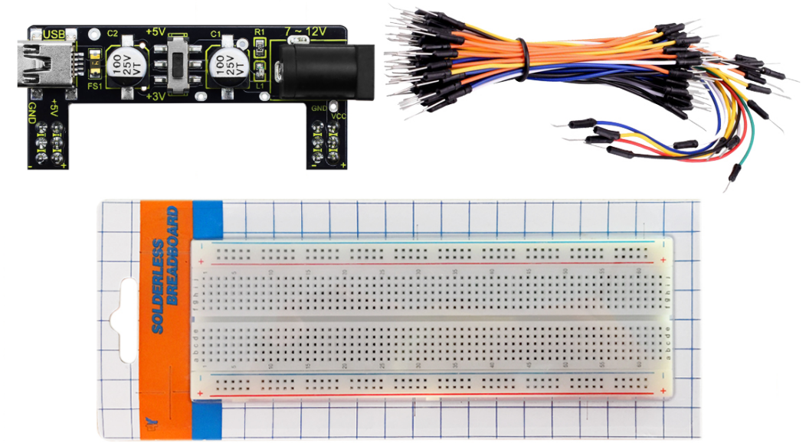
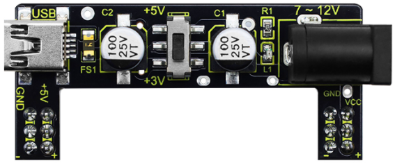
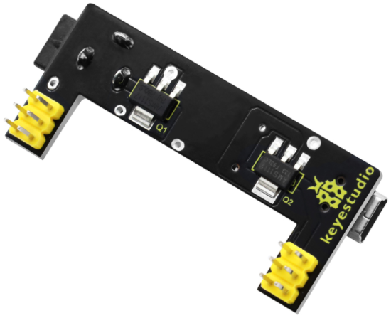
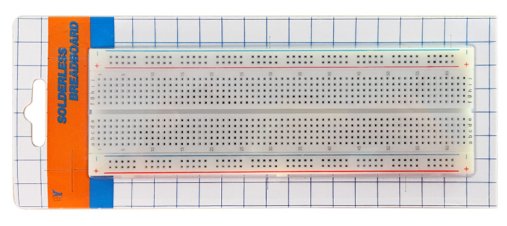
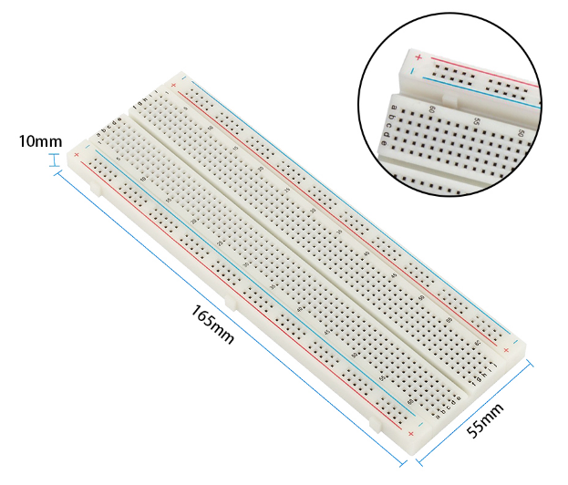
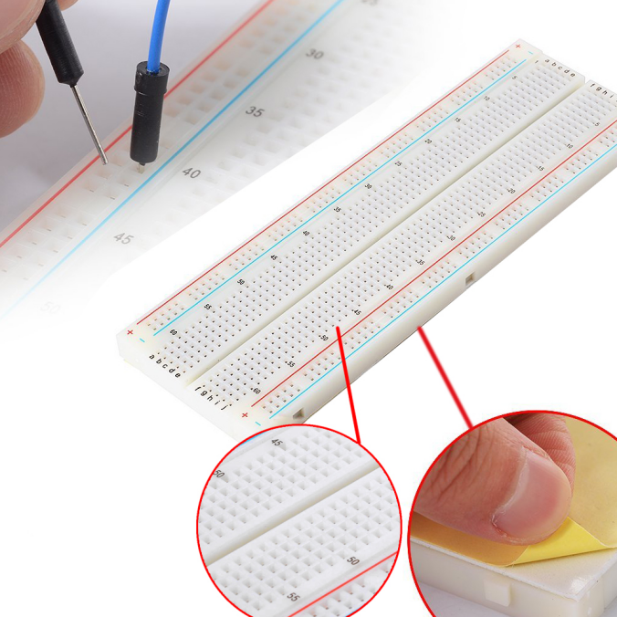
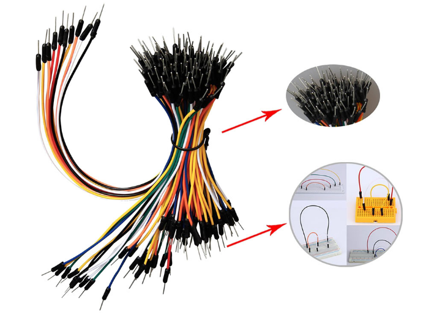

# Keyestudio Breadboard Power Module+830-Hole Solderless Breadboard+65 Jumper Wires Package

## Introduction:

This package includes a 830-hole breadboard, a keyestudio breadboard power module and breadboard jumper wire pack of 65. You can freely add other components on the breadboard to design your own circuit.

Keyestudio breadboard power module is compatible with 5V and 3.3V, suitable for MB102 breadboard. This module includes dual independent control, one can be powered by USB port to output the voltage constantly for DC 5V; Another one is to power with DC 6.5-12V, and output controlled by dial switch, respectively for DC5V and DC3.3V.

## Keyestudio Breadboard Power Module:

Keyestudio breadboard power module is compatible with 5V and 3.3V, suitable for MB102 breadboard. This module includes dual independent control, one can be powered by USB port to output the voltage constantly for DC 5V; Another one is to power with DC 6.5-12V, and output controlled by dial switch, respectively for DC5V and DC3.3V.

- Input Voltage：DC 6.5-12V or USB power
- Output Voltage：3.3V and 5V can be switched 
- Max Output Current：<700ma 
- Dual independent control, can be switched to 3.3V and 5V
- Onboard comes with two groups of DC output contact pins, easy for external use.

## 830-Hole Solderless Breadboard:

The breadboard has 2 split power buses, 10 columns, and 63 rows - with a total of 830 tie in points. This breadboard also has a self-adhesive on the back. You can stick it on any devices as you like. The boards also have interlocking parts, so you can hook as many together as you’d like. 

 Dimensions of bare breadboard:165×56*10mm

## Jumper Wire Pack of 65:

These are jumpers with male connectors on both ends.Use these to jumper from any female header on any board to any other female header. These Multiple jumpers also can be easily plugged into the breadboard. Comes as one pack of 65 jumpers with an assortment of colors.

